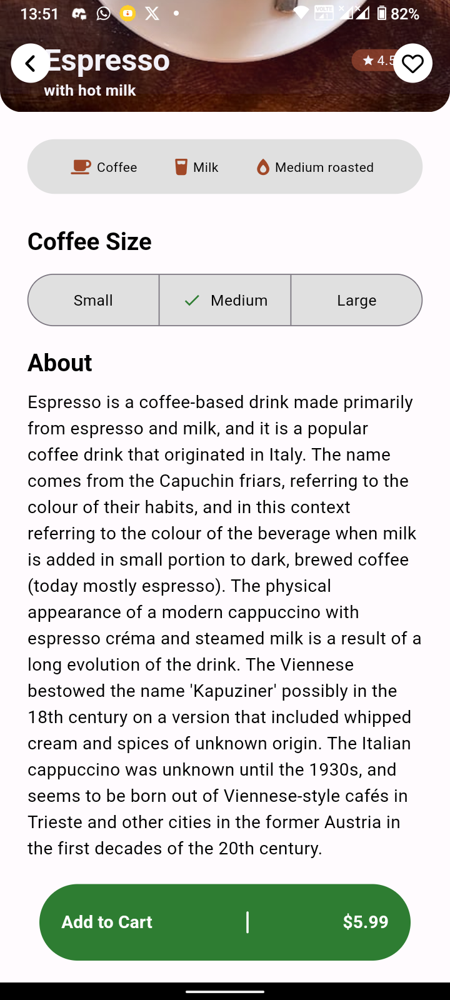

# Coffee

A new Flutter project replicating a Dribble UI design for a coffee shop mobile app.

[Dribble Design Reference](https://dribbble.com/shots/16286988-Coffee-Shop-Mobile-App)

## Getting Started

This project is a replica of a coffee shop mobile app UI, initially designed on Dribble. It's developed in Flutter to demonstrate beautiful and responsive UI practices in mobile app development.

## App Screenshots

  
  
  
  
  

